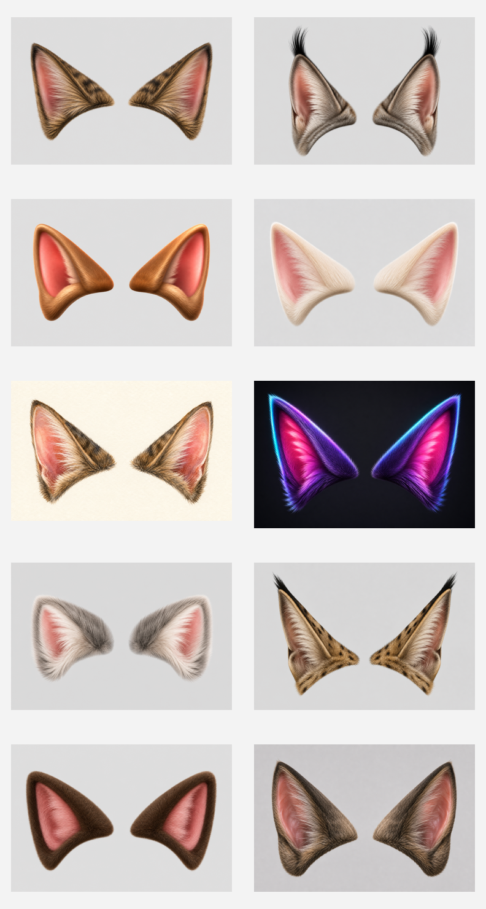

# Improved Cat Ear Style Proposals

Generated concept previews for exploring prettier, more dimensional cat ears
than the current procedural 2D shapes.

These are not production-ready app assets. They are visual direction references:
shape language, fur treatment, rosy inner-ear material, edge softness, and how
far the style can move toward 3D while still reading as an AR overlay.

## Contact Sheet

## Variants

| # | File | Direction | Implementation implication |
| --- | --- | --- | --- |
| 1 | `01_plush_realistic_tabby.png` | Natural tabby fur, warm brown, rosy inner ear. | Good baseline for a prettier default style; could be approximated with layered polygons, gradients, and fur strokes. |
| 2 | `02_lynx_tufted_premium.png` | Taller ears with black tufts and premium wildcat feel. | Needs tip-tuft primitives or texture sprites; strong silhouette for a special style. |
| 3 | `03_glossy_stylized_3d.png` | Clean sculpted 3D, readable and polished. | Best candidate if the app moves toward pre-rendered texture sprites. |
| 4 | `04_soft_velvet_cream.png` | Cream velvet fur with gentle rosy interior. | Good soft/cute variant; mostly gradients plus subtle short-fur noise. |
| 5 | `05_watercolor_realistic_painterly.png` | Painterly realistic ears with hand-made charm. | Harder to proceduralize; useful as an art-direction reference for textured assets. |
| 6 | `06_neon_party_fox_cat.png` | Party Mode energy: violet fur, cyan rim light, magenta inner ear. | Good for Party Mode or tint experiments; needs controlled glow so it does not overpower faces. |
| 7 | `07_fluffy_kitten.png` | Small, rounded, downy kitten ears. | Good cute/default alternate; requires fuzzy edge treatment and soft base. |
| 8 | `08_wildcat_realistic.png` | Tawny wildcat shape with darker rim and subtle markings. | Good realistic premium style; needs spots/stripe detail or texture lookup. |
| 9 | `09_plush_soft_toy_realistic_fur.png` | Cozy plush shape with realistic fur and satin-like inner ear. | Strong social-filter style; can be approximated with pre-rendered sprites. |
| 10 | `10_game_ready_pbr_natural.png` | PBR-like real-time game asset, restrained and natural. | Best technical reference for a future 3D or normal-map-inspired implementation. |

## Practical Takeaways

For a near-term app improvement, the strongest path is probably a hybrid:

1. Keep procedural placement, tracking, tinting, and animation.
2. Replace the flat ear body with richer layered drawing:
   - outer fur body gradient
   - rosy inner-ear triangle with soft rim
   - darker edge fur strokes
   - optional tufts and markings per style
3. Add a small style-specific texture/noise pass rather than fully generated
   bitmap ears.

For the most realistic look, use pre-rendered texture sprites derived from one
chosen direction. That would look better quickly, but would make tinting,
animation, and mirroring less flexible than the current procedural system.
